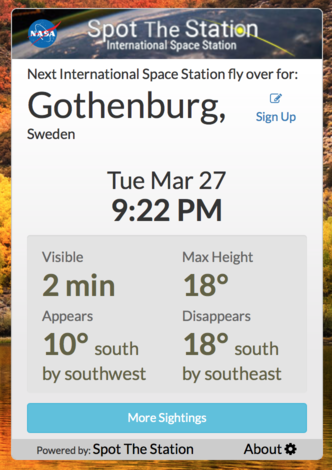

# Spot The Station Übersicht Widget
Shows when the ISS is visible over a specific location the next time. Widget updates every 92 minutes which is the round trip time for ISS around the earth.

## Installation
Change location data in index.coffee